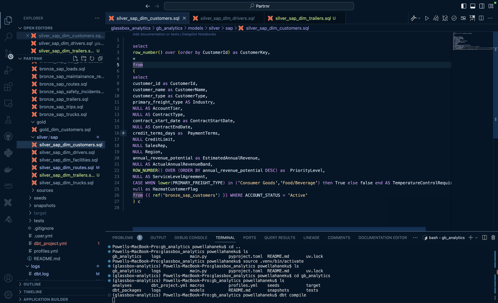
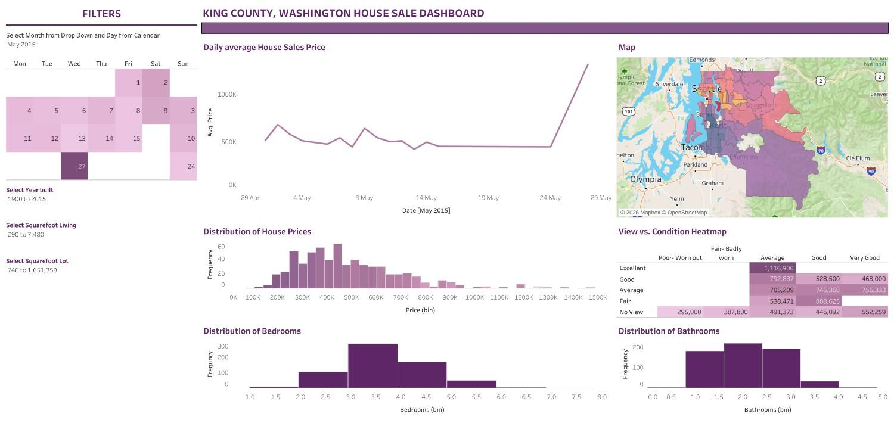
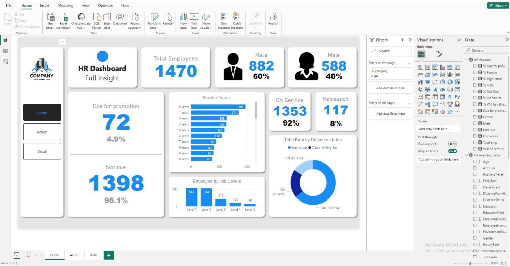

# Powell's Project Portfolio

`Data Engineering` `Data Architecture` `Data Modelling`

---

Hello and welcome! I’m **Powell Ahaneku**, a data engineer and BI developer. This portfolio highlights my work across data analytics, modelling and architecture. I blend tools like SQL, Python, and Power BI with creativity to deliver actionable insights and interactive experiences.

---

## Core Skills

- **Data Analytics:** SQL (PostgreSQL, MySQL), Python (Pandas, NumPy, Scikit-Learn), Excel, Power BI, 
- **Data Engineering:** ETL processes, data modeling, warehousing (Google BigQuery, Snowflake, Azure, AWS, Informatica, SSMS, Medallion architecture)  
- **Visualization & Reporting:** Power BI dashboards, Tableau visualizations, Excel modeling  

---

## Featured Projects

### 1. [Snowflake + dbt + AWS Data Warehouse](https://github.com/powellahaneku/db_analytics_demo/tree/main) (2026)
A data warehousing solution leveraging cloud-native AWS services to ingest, transform, and analyze data at scale. Built with Python for extraction, Amazon S3 for storage, Snowflake for warehousing, and dbt for transformation and data modeling. Showcases implementation of Medallion architecture and scalable ELT pipelines.  
**Key Tools:** Python, AWS, Snowflake, dbt, SQL
[View Project](https://github.com/powellahaneku/db_analytics_demo/tree/main)

---

### 2. [GCP Based 311 Service Analytics](https://github.com/powellahaneku/datawarehouse/tree/main)  (2025)
A data warehousing solution leveraging NYC Open Data APIs to analyze patterns in city complaints and traffic collisions. Built with Python for extraction, Google BigQuery for storage, and Power BI for interactive dashboards. Showcases data modeling using Medallion architecture and geospatial insights.  
**Key Tools:** Python, Google Cloud, Power BI, SQL, APIs  
[View Project](https://github.com/powellahaneku/datawarehouse/tree/main)

---

### 3. [Power BI & DAX Sales Analytics Dashboard](https://public.tableau.com/app/profile/powell.ahaneku/viz/KingsCountyHouseSales_17073741715870/KingCountyHouseSales?publish=yes)  (2023)
An interactive Tableau visualization analyzing house sales in King County, WA, highlighting price trends, geographical insights, and market indicators.  
**Key Tools:** Tableau Public, Excel  
[View Project](https://github.com/powellahaneku/HouseSaleDashboard/blob/main/readme.md)

---

### 4. [Power BI & DAX HR Analytics Dashboard](https://github.com/powellahaneku/HRDataAnalysis/blob/main/HR%20Data%20Analysis.pdf)  (2023)
A Power BI dashboard offering comprehensive HR metrics like headcount, attrition, promotions, and overtime trends. Built with DAX, Excel, and Power Query for clean ETL processes.  
**Key Tools:** Power BI, DAX, SQL, Excel  
[View Project](https://github.com/powellahaneku/HRDataAnalysis/blob/main)

